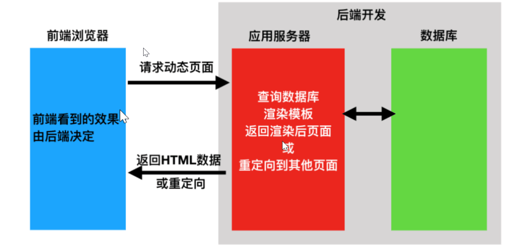

## **一、前后端分离**
 	前后端分离已成为互联网项目开发的业界标准使用方式，通过nginx+tomcat的方式（也可以中间加一个nodejs）有效的进行解耦，并且前后端分离会为以后的大型分布式架构、弹性计算架构、微服务架构、多端化服务（多种客户端，例如：浏览器，车载终端，安卓，IOS等等）打下坚实的基础。这个步骤是系统架构从猿进化成人的必经之路。

**核心思想是前端html页面通过ajax调用后端的restful api接口并使用json数据进行交互。**

在互联网架构中，名词解释：1111

**Web服务器**：一般指像nginx，apache这类的服务器，他们一般只能解析静态资源。

**应用服务器**：一般指像tomcat，jetty，resin这类的服务器可以解析动态资源也可以解析静态资源，但解析静态资源的能力没有web服务器好。

**一般都是只有web服务器才能被外网访问，应用服务器只能内网访问。**

### 前后端不分离模式：

​	在前后端不分离的应用模式中，前端页面看到的效果都是由后端控制，由后端渲染页面或重定向，也就是后端需要控制前端的展示，前端与后端的耦合度很高。

​        这种应用模式比较适合纯网页应用，但是当后端对接App时，App可能并不需要后端返回一个HTML网页，而仅仅是数据本身，所以后端原本返回网页的接口不再适用于前端App应用，为了对接App后端还需再开发一套接口。

请求的数据交互如下图:

### 前后端分离模式：

​      在前后端分离的应用模式中，后端仅返回前端所需的数据，不再渲染HTML页面，不再控制前端的效果。至于前端用户看到什么效果，从后端请求的数据如何加载到前端中，都由前端自己决定，网页有网页的处理方式，App有App的处理方式，但无论哪种前端，所需的数据基本相同，后端仅需开发一套逻辑对外提供数据即可。

在前后端分离的应用模式中 ，前端与后端的耦合度相对较低。

在前后端分离的应用模式中，我们通常将后端开发的每个视图都称为一个接口，或者API，前端通过访问接口来对数据进行增删改查。

对应的数据交互如下图 :

## 二、术业有专攻（开发人员分离）

以前的JavaWeb项目大多数都是java程序员又做前端，又做后端。

随着时代的发展，渐渐的许多大中小公司开始把前后端的界限分的越来越明确，前端工程师只管前端的事情，后端工程师只管后端的事情。

1、对于后端java工程师：

把精力放在java基础，设计模式，jvm原理，spring+springmvc原理及源码，linux，mysql事务隔离与锁机制，mongodb，http/tcp，多线程，分布式架构，弹性计算架构，微服务架构，java性能优化，以及相关的项目管理等等。

后端专注于：后端控制层（Restful API） & 服务层 & 数据访问层；

**后端追求的是：三高（高并发，高可用，高性能），安全，存储，业务等等。**

2、对于前端工程师：

把精力放在html5，css3，jquery，angularjs，bootstrap，reactjs，vuejs，webpack，less/sass，gulp，nodejs，Google V8引擎，javascript多线程，模块化，面向切面编程，设计模式，浏览器兼容性，性能优化等等。

前端专注于：前端控制层（Nodejs） & 视图层

**前端追求的是：页面表现，速度流畅，兼容性，用户体验等等。**

术业有专攻，核心竞争力才会越来越高，通过将team分成前后端team，让两边的工程师更加专注各自的领域，独立治理，然后构建出一个全栈式的精益求精的team。
